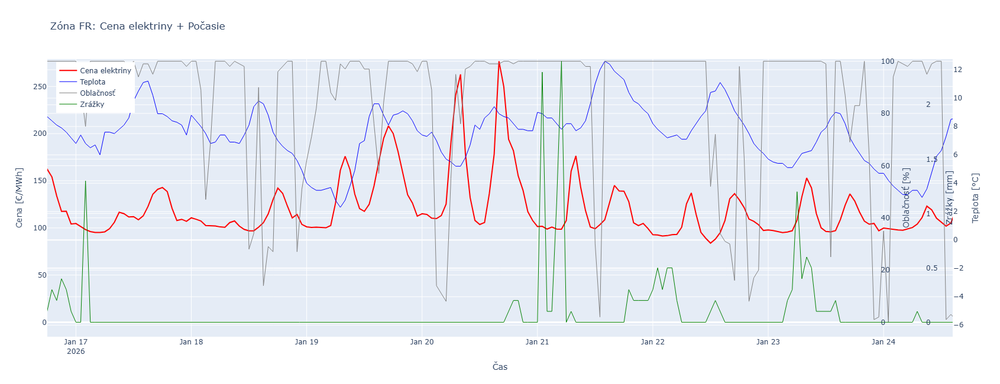

# EnergyWeather Correlation

Projekt analyzuje vzťah medzi hodinovými cenami elektriny v Europe podla krajiny a priemernou dennou teplotou krajiny. Dáta sa získavajú automaticky z verejných API, ukladajú do lokálnej SQLite databázy a následne sa vizualizujú a porovnávajú.

---

## 🔍 Ciele projektu
- Získať hodinové ceny elektriny pre Európu (EUR/MWh).
- Získať priemernú dennú teplotu krajiny a počasie.
- Ukladať dáta do SQLite databázy.
- Porovnávať vývoj cien elektriny s počasím.
- Vytvoriť základ pre ďalšiu analýzu alebo vizualizáciu.

---


---

## 🌐 Použité API

### 1. Ceny elektriny – Energy-Charts API
- Endpoint: `https://api.energy-charts.info/price`
- Parametre: `country=CZE`, `start=YYYY-MM-DD`, `end=YYYY-MM-DD`
- Príklad response z API:
    ```json [
  {
    "id": 300507,
    "timestamp": "2026-01-20T23:30:00",
    "zone": "FR",
    "value": 107.42,
    "country_name": "Francúzsko"
  },
  {
    "id": 300508,
    "timestamp": "2026-01-20T23:45:00",
    "zone": "FR",
    "value": 98.14,
    "country_name": "Francúzsko"
  },
  {
    "id": 300509,
    "timestamp": "2026-01-21T00:00:00",
    "zone": "FR",
    "value": 99.93,
    "country_name": "Francúzsko"
  },
  {
    "id": 300510,
    "timestamp": "2026-01-21T00:15:00",
    "zone": "FR",
    "value": 99.75,
    "country_name": "Francúzsko"
  },
  {
    "id": 300511,
    "timestamp": "2026-01-21T00:30:00",
    "zone": "FR",
    "value": 102.13,
    "country_name": "Francúzsko"
  }
]

- Výstup:  
  - `id[]` – unikátny identifikátor
  - `timestamp[]` – časové značky  
  - `vaule[]` – ceny v EUR/MWh  
  - `zone[]` – zona v Európe
  - `source[]` – názov zóny


### 2. Počasie – Open-Meteo API
- Endpoint: `https://api.open-meteo.com/v1/climate`
  - Príklad response z API:
    ```json [
      {
        "id": 840888,
        "timestamp": "2025-06-19T09:00:00",
        "value": 0,
        "zone": "ES",
        "source": "ES_precipitation"
      },
      {
        "id": 840889,
        "timestamp": "2025-06-19T09:00:00",
        "value": 3,
        "zone": "ES",
        "source": "ES_weathercode"
      },
      {
        "id": 840890,
        "timestamp": "2025-06-19T09:00:00",
        "value": null,
        "zone": "ES",
        "source": "ES_weather_text"
      },
      {
        "id": 840891,
        "timestamp": "2025-06-19T10:00:00",
        "value": 33.3,
        "zone": "ES",
        "source": "ES_temperature"
      },
      {
        "id": 840892,
        "timestamp": "2025-06-19T10:00:00",
        "value": 100,
        "zone": "ES",
        "source": "ES_cloudcover"
      }
    ]

- Výstup:
  - `id[]` – unikátny identifikátor
  - `timestamp[]` – časové značky  
  - `value[]` – hodnota 
  - `zone[]` – zóna v Európe
  - `source[]` – typ hodnoty počasia
    - ej.:
      -  CZE	CZE_temperature 
      - CZE	CZE_cloudcover      
      - CZE	CZE_precipitation
      - CZE	CZE_weathercode 
      - CZE	CZE_weather_text


---
## 🗃️ Štruktúra projektu

```markdown 
app/
├── api/
├── database/
├── modules/
├── router/
├── tests/
├── utils/
└── main.py
```

---

## 🗃️ Databáza

Použitá je **SQLite**, pretože:
- nevyžaduje server,
- je ideálna pre malé a demo projekty,
- je súčasťou Pythonu.

Príklad y tabuľky electricity_price_data

| ID     | Timestamp           | Krajina | Hodnota | Názov krajiny |
|--------|----------------------|---------|---------|----------------|
| 300507 | 2026-01-20T23:30:00 | FR      | 107.42  | Francúzsko     |
| 300508 | 2026-01-20T23:45:00 | FR      | 98.14   | Francúzsko     |
| 300509 | 2026-01-21T00:00:00 | FR      | 99.93   | Francúzsko     |
| 300510 | 2026-01-21T00:15:00 | FR      | 99.75   | Francúzsko     |
| 300511 | 2026-01-21T00:30:00 | FR      | 102.13  | Francúzsko     |
| 300512 | 2026-01-21T00:45:00 | FR      | 104.15  | Francúzsko     |

Príklad y tabuľky weather_data

| ID     | Timestamp           | Hodnota | Kód krajiny | Parameter          |
|--------|----------------------|---------|-------------|--------------------|
| 840888 | 2025-06-19T09:00:00 | 0       | ES          | ES_precipitation   |
| 840889 | 2025-06-19T09:00:00 | 3       | ES          | ES_weathercode     |
| 840890 | 2025-06-19T09:00:00 |         | ES          | ES_weather_text    |
| 840891 | 2025-06-19T10:00:00 | 33.3    | ES          | ES_temperature     |
| 840892 | 2025-06-19T10:00:00 | 100     | ES          | ES_cloudcover      |
| 840893 | 2025-06-19T10:00:00 | 0       | ES          | ES_precipitation   |
| 840894 | 2025-06-19T10:00:00 | 3       | ES          | ES_weathercode     |
| 840895 | 2025-06-19T10:00:00 |         | ES          | ES_weather_text    |


---
## 🗃️ Architektúra 

                Energy-Charts API
                       \
                        \
                         →→→  Data Collector  →→→  SQLite Database  →→→  Compare.py  →→→  Grafy
                        /
                       /
                Open-Meteo API


---
## ⚙️ Inštalácia
### Základné informáacie

Požadovaná verzia pythonu 
 - 3.10.x

Príkaz pre spustenie FastAPI
  - uvicorn app.api.main:app --reload,

Príkaz pre spustenie zberu dát  
  - python main.py.

To usnadní první spuštění projektu.

### 1. Klonovanie projektu

git clone https://github.com/username/EnergyWeather-Correlation.git (github.com in Bing)
cd EnergyWeather-Correlation

### 3. Inštalácia balíkov

pip install -r requirements.txt

---

## 📥 Zber dát

### Spustenie skriptu na zber dat a nasledne vykreslenie grafov podla Zony

run main

pre otvorenie Swaggeru: 
- uvicorn app.main:app --reload
- http://127.0.0.1:8000/docs


---

## 📊 Analýza

Skript `graf.py` porovnáva:
- hodinové ceny elektriny,
- hodinové počasie,

Výstupom je graf:
 - pre všetky dostupne zóny v Európe
 - spúšťa sa automatickz po zbere dát v main


---

## 📄 Licencia
MIT License

---

## 👤 Autor
Petra Mitroova
Slovenska republika 
2026

🚀 Future Work
🔧 Rozšírenie dátových zdrojov
Integrácia ďalších meteorologických premenných (vietor, oblačnosť, zrážky, slnečný svit) pre presnejšie modelovanie.

Pridanie dát o spotrebe elektriny, výrobe z obnoviteľných zdrojov a cezhraničných tokov.

Podpora viacerých krajín EÚ pre porovnanie regionálnych rozdielov.

📈 Pokročilá analýza a modelovanie
Výpočet korelačných koeficientov pre rôzne časové obdobia (hodiny, dni, sezóny).

Vytvorenie prediktívneho modelu (napr. regresia, LSTM) na odhad budúcich cien elektriny na základe počasia.

Detekcia anomálií v cenách (extrémne výkyvy, negatívne ceny).

🖥️ Vizualizácie a dashboard
Interaktívny dashboard (Streamlit alebo Dash) s grafmi cien, teplôt a korelácií.

Heatmapy zobrazujúce vzťah medzi hodinou dňa, teplotou a cenou.

Export grafov do PNG/HTML pre prezentácie.

🗄️ Vylepšenie dátovej infraštruktúry
Prechod zo SQLite na PostgreSQL pre robustnejšie spracovanie dát.

Automatické čistenie a validácia dát pri ukladaní.

Pravidelné archivovanie starších dát.

🔄 Automatizácia a prevádzka
Plná automatizácia ETL pipeline (napr. pomocou cron/Task Scheduler).

Dockerizácia projektu pre jednoduché nasadenie.

Monitoring chýb a logovanie API odpovedí.

🌍 Kontextové obohatenie
Pridanie informácií o cenách emisných povoleniek (ETS), ktoré ovplyvňujú cenu elektriny.

Porovnanie s cenami plynu a ropy.


